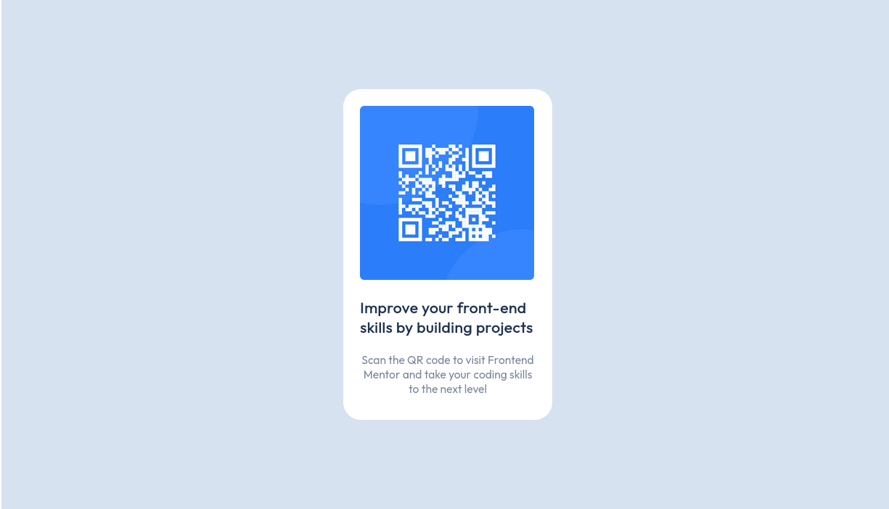

# Frontend Mentor - QR code component solution

This is a solution to the [QR code component challenge on Frontend Mentor](https://www.frontendmentor.io/challenges/qr-code-component-iux_sIO_H). Frontend Mentor challenges help you improve your coding skills by building realistic projects. 

## Table of contents

- [Overview](#overview)
  - [Desktop-preview](#desktop-preview)
  - [Mobile-preview](#mobile-preview)
  - [Links](#links)
  - [Built with](#built-with)
- [Author](#author)

## Overview
This is a responsive solution of QR Code component, it is implemented using HTML and CSS.
And layout of flexbox

### Desktop-preview

### Mobile-preview

**Screenshots of both the desktop and mobile preview**

### Links

- Solution URL: https://github.com/Forester5/Frontend_Practice.git
- Live Site URL: https://forester5.github.io/Frontend_Practice/qr_code_component

### Built with

- Semantic HTML5 markup
- CSS custom properties
- Flexbox
- Mobile-first workflow

## Author
- Frontend Mentor - [@Forester04](https://www.frontendmentor.io/profile/Forester04)